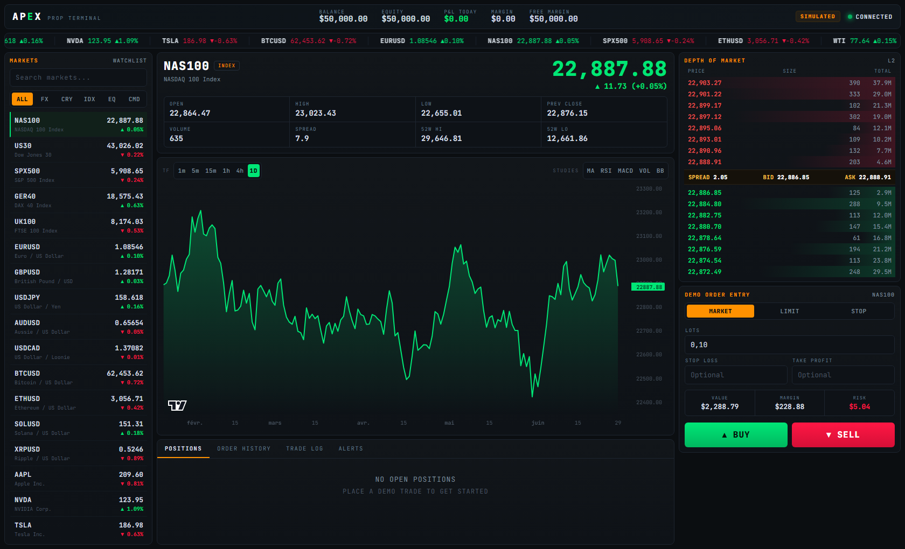

# APEX — Terminal de Trading Temps Réel

Terminal financier haute densité, style *prop firm*, avec **simulateur d'investissement**.
Prix de marché **réels** (Yahoo Finance, sans clé) + flux temps réel optionnel (Finnhub),
graphiques **TradingView**, ordres MARKET/LIMIT/STOP, stop-loss/take-profit, alertes et historique persistant.



## Stack

| Couche | Techno |
|---|---|
| Frontend | React 18 · TypeScript · Vite · Zustand · [lightweight-charts](https://github.com/tradingview/lightweight-charts) |
| Backend | FastAPI · Uvicorn · WebSockets · NumPy |
| Données | **Yahoo Finance** (historique + cotations, sans clé) · **Finnhub** (ticks temps réel + news, clé optionnelle) · **FRED** (éco/calendrier, clé optionnelle) |

## Démarrage

```bash
# 1) Backend  → http://localhost:8000
cd backend
pip install -r requirements.txt
python -m uvicorn main:app --port 8000

# 2) Frontend → http://localhost:5173
cd frontend
npm install
npm run dev
```
Sous Windows : `./dev.ps1` lance les deux. Ouvre **http://localhost:5173**.

Tout fonctionne **sans aucune clé** (données réelles via Yahoo). Deux clés gratuites optionnelles :
`cp backend/.env.example backend/.env` puis renseigne-les et relance le backend.
- `FINNHUB_API_KEY` — ticks crypto/forex/actions ultra-réactifs.
- `FRED_API_KEY` — données économiques du Macro Dashboard (CPI, PIB, chômage, taux, courbe,
  publications). Sans elle, ces panneaux affichent un état « add key » (rien n'est simulé).

## Architecture

```
            Yahoo Finance (keyless)            Finnhub WS (clé optionnelle)
            historique + cotations             ticks crypto / forex / actions
                     │                                   │
                     ▼                                   ▼
        ┌─────────────────────────────────────────────────────┐
        │  FastAPI backend (:8000)                             │
        │   poll_loop (indices/commodités) · baseline_loop      │
        │   finnhub_loop · simulator · Hub → WebSocket          │
        └───────────────┬───────────────────────────────────────┘
              /api/* REST │ /ws/prices (push)
                          ▼
        ┌─────────────────────────────────────────────────────┐
        │  Vite dev server (:5173) — proxy /api + /ws → :8000   │
        │  Terminal React (3 colonnes)                          │
        └─────────────────────────────────────────────────────┘
```

## Fonctionnalités

- **Macro Dashboard** (onglet principal, bascule depuis le header) — vision institutionnelle :
  - **Risk Barometer** : score composite **Risk-On/Risk-Off 0–100** (VIX, crédit HY/IG, actions vs
    obligations, DXY, or) en cadran animé.
  - **Courbe des taux** (interactive), **taux directeurs**, **VIX / régime de risque** (+ sparkline),
    **US Dollar (DXY)**, **heatmap cross-asset** (tuiles cliquables → terminal).
  - **Sector RRG** : *Relative Rotation Graph* des 11 secteurs vs SPY (4 quadrants, traînées au survol).
  - **Corrélations cross-asset** : heatmap Pearson des rendements journaliers sur 3 mois (numpy).
  - **Live Wire Center** : fil de **news** (Finnhub + repli RSS Yahoo, pastille d'importance) et
    **calendrier économique** des prochaines publications (dates FRED).
  - **Indicateurs économiques** (CPI, PIB, chômage, taux) via **FRED**.
  - Macro de marché **réelle** via Yahoo (sans clé) ; l'éco vient de **FRED** (clé gratuite dans
    `backend/.env`, `FRED_API_KEY`) — sinon ces panneaux invitent à ajouter la clé (**rien n'est simulé**).
- **Watchlist** personnalisable : recherche n'importe quel marché (actions, indices, forex, crypto,
  matières premières), ajout/suppression, **sauvegardée** (localStorage).
- **Graphique néon** TradingView · durées **1D · 1W · 1M · 3M · 6M · YTD · 1Y · 5Y · MAX**
  (l'axe colle toujours à la durée) · **performance de la période en %** affichée sur le graphe ·
  studies **MA · BB · VOL · RSI · MACD**.
- **Carnet d'ordres** (L2 simulé, cohérent avec le spread affiché) + **ticket** :
  - **MARKET** (exécution immédiate), **LIMIT** / **STOP** (ordres en attente, onglet PENDING).
- **Simulateur** : clôture manuelle ou auto via **Stop-Loss / Take-Profit**, **alertes de prix**,
  **historique** persistant (TRADE LOG, ORDER HISTORY), notifications toast, et compte calculé
  (Balance / Equity / P&L journalier / Marge).

## Données — transparence

Prix, variations %, OHLC et historique sont **réels** (Yahoo). En revanche le **carnet d'ordres**
et le **spread** sont **simulés** (aucune source L2 gratuite n'existe) ; le carnet dérive du même
spread que la grille pour rester cohérent. Aucun ordre n'est envoyé à un vrai broker — c'est un démo/simulateur.

## Structure

```
backend/    main.py · feeds.py · market.py · providers.py · macro.py · assets.py · hub.py · config.py
frontend/   src/{store.ts, api.ts, indicators.ts, components/*, components/macro/*}
CLAUDE.md   guide pour agents IA
dev.ps1     lance backend + frontend
```

## Scripts

| Commande | Effet |
|---|---|
| `npm run dev` | serveur de dev + HMR |
| `npm run build` | typecheck + bundle de production (`dist/`) |
| `uvicorn main:app` | API + flux WebSocket |
